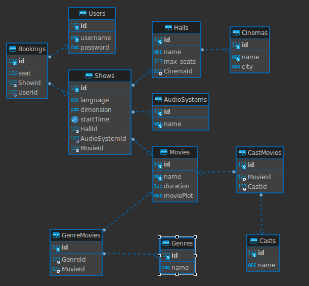
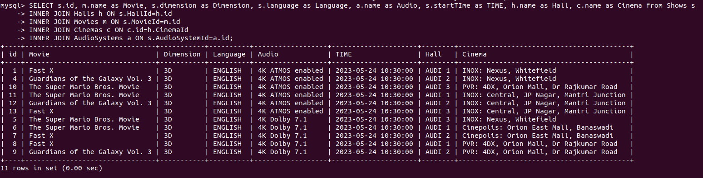
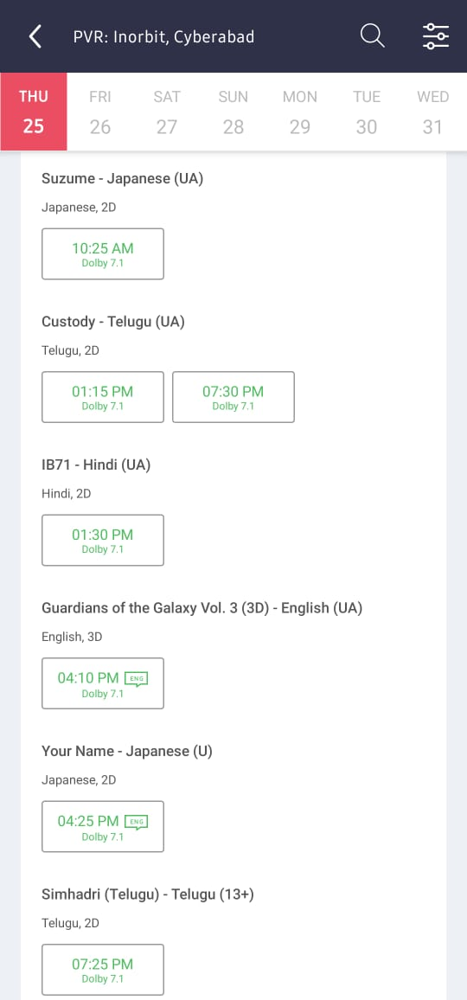

# bookmyshow-api-nodejs-sql

POSTMAN DOCS - [here](https://documenter.getpostman.com/view/7984450/2s93m5zgVx)

#### This is an API for booking movie tickets.

1. Get available movies for given - Cinema, Date
2. Check available seats for a show
3. Book tickets for a slot

#### Which columns should be indexed?

It's important to note that adding indexes also comes with some overhead, as they consume additional storage space and require maintenance during data modification operations (such as inserts, updates, and deletes).
Hence we should add them only when a bottleneck is observed.

In this example indexing the foreign keys for Shows table would be good as this will speed up our joins.
Also if we want to prioritise them then indexing the HallId in Shows table should be prioritised as it is used more frequently than the rest.

### Checklist

- [x] JWT Auth
- [x] Normalisation of database
- [x] Locking the DB while bulk operation with transactions
- [x] Indexing for better performance

### Example Query for the UI below

