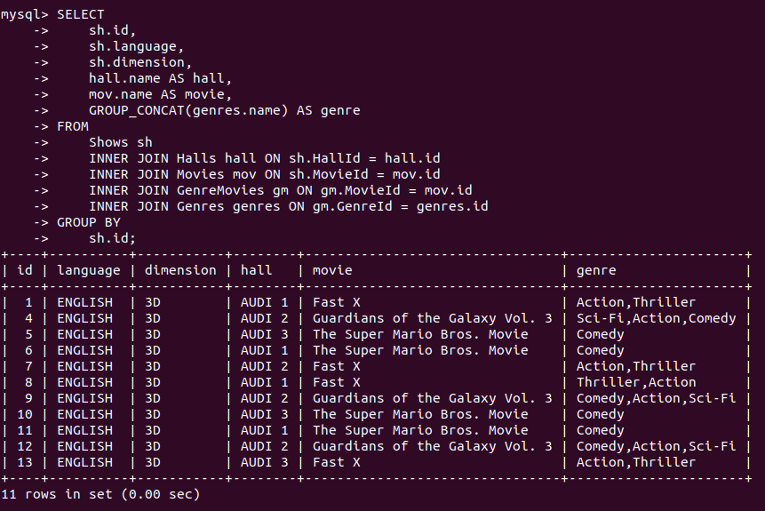

# bookmyshow-api-nodejs-sql

POSTMAN DOCS - [here](https://documenter.getpostman.com/view/7984450/2s93m5zgVx)

This repository contains the code for a movie ticket booking API. The API allows users to select a theatre in the city and see the dates of the next 7 days. Users can then click on any date to see all the movies in that theatre on that given date. Movies are displayed with details of all the showtimes.

